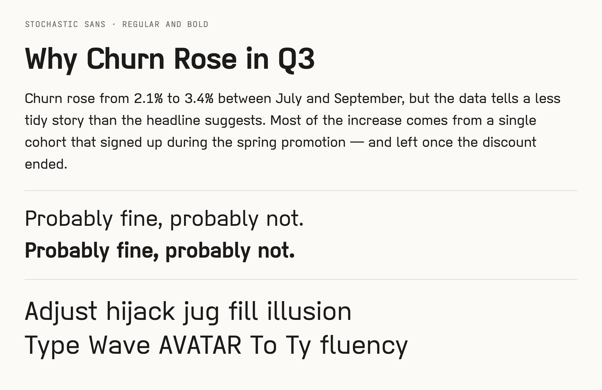
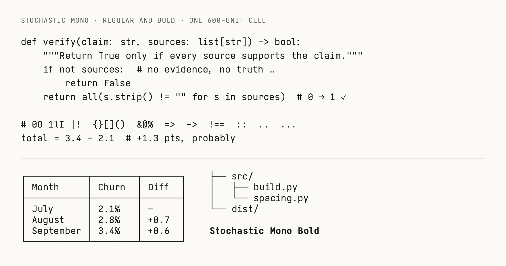
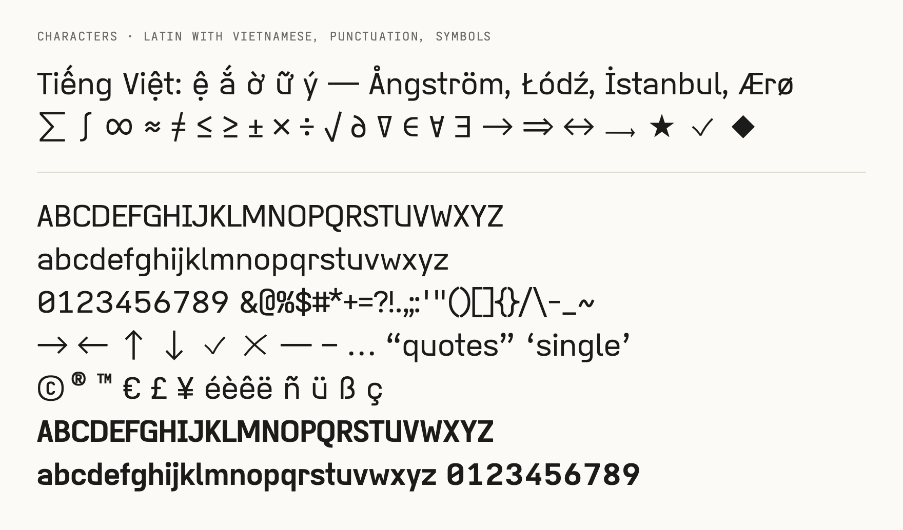
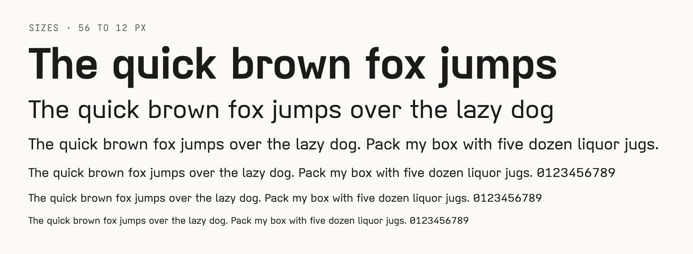

# Stochastic Type

Stochastic Type is a font family for LLM-published content, built by a stochastic parrot. Made for long prose: letters are spaced from their outlines, weights are moderate, and the terminals share one flat gesture (a rounded corner into a flat run).









It is a derivative of [Iosevka](https://github.com/be5invis/Iosevka) (SIL OFL 1.1, `OFL.txt`) and stays OFL. Two typefaces, Stochastic Sans (proportional) and Stochastic Mono (fixed cell, every glyph one cell wide), each static Regular and Bold. Latin (including Vietnamese), punctuation, currency, arrows, math, shapes and common symbols, plus box drawing, block elements, Braille, Powerline and legacy-computing graphics. No other scripts.

## Build

```
make
```

Managed with [uv](https://docs.astral.sh/uv/): every step runs through `uv run`, which creates the environment from `pyproject.toml` and `uv.lock` on first use. The Iosevka base is built from source, so `git`, `node` and `npm` are also needed. The first `make` clones Iosevka into `build/` at the release pinned as `REF` in `font/iosevka.py` (upgrading it is a deliberate edit there; the build is reproducible only for a fixed Iosevka) and takes a few minutes; after that the graph is incremental: changing a script in `font/` rebuilds the fonts, and the Iosevka base is rebuilt only when `font/iosevka-plan.toml` or `font/iosevka.py` changes. `make -j2` builds both weights in parallel. `make clean` removes `dist/`; `make distclean` also removes `build/` and `.venv`.

Outputs in `dist/`: `StochasticSans-{Regular,Bold}.ttf`, `StochasticMono-{Regular,Bold}.ttf`, the same four as `.woff2` for the web, `OFL.txt`, and `specimen.html`, a static page that loads the fonts from the same directory (open it straight from disk). Static fonts only, TTF and WOFF2.

The screenshots at the top come from `specimen/shots.html`; `make shots` renders them at 2x into `docs/` (needs Chrome or Chromium, or `CHROME` set, and the built fonts).

## Pipeline

| Step | File | What it does |
|---|---|---|
| Base | `iosevka-plan.toml`, `iosevka.py` | Two custom Iosevka builds, quasi-proportional sans and `term` monospace, double-storey `a` with the flat bottom also on `b d u` and the capitals `U G`, `f` crossbar level with `t`, single-storey `g`, straight `y`, slashed zero, serifed `I`; flat-hook `t`, `f`, `j` and `g`, semi-tailed `l` in the sans, a flat-top `r` in both, anchored (serifed) `i`, flat-tailed `l` and serifed `j` in the mono; the junction rule is flat at the baseline and eared at the x-height, with the flat-top `r` as the one exception; x-height and cap height set through `metricOverride`. |
| Subset and scale | `build.py`, `charset.py` | Keeps the codepoints in `charset.py` (Latin and symbols, no other scripts), scales to the target x-height. |
| Spacing | `spacing.py`, `kerning.py`, `tuck.py` | Sans: Iosevka centres letters in near-uniform cells; `kerning.py` then adds pair kerning that moves every pair toward one optical gap, tucks marks under overhanging letters, and keeps every pair clear of a collision. Sidebearings are recomputed from each outline: straight sides get room, receding sides (`t f r v y`) less, digits stay tabular, hooks keep clearance, accents follow their base (a wider accent may reach 35 units into a neighbour, no more), and glyphs built from parts side by side (`„ « № IJ`) are plain glyphs with their own advance. Mono: the fixed cell stays, and `tuck.py` adds contextual `kern` positioning that closes loose letter pairs by sharing the closure over the pair and the glyph on each side, and moves sentence marks toward the letter before them, inside their own cells (advances never change). |
| Outlines | `hooks.py`, `braces.py`, `caps.py`, `marks.py`, `glyphs.py`, `outline.py` | Letters keep Iosevka's own outlines and weight (the plan sets the stem). `hooks.py` cuts the hooks of `t`, `f` and `j` back to the length of `l`'s tail, shortens the crossbars of `t` and `f` and the arm of the sans `r` (a slice out of the middle, so its curl stays), and lowers the foot of the sans `t` to `l`'s baseline; `caps.py` widens the sans capitals, digits, currency signs and `& @ % $ #` by shape group (rounds most) by stretching the counters only, so every capital stem has the same weight; `braces.py` lengthens the middle tip of `{ }` and shortens their arms, so a brace does not read as a parenthesis when blurred; `marks.py` scales the dots and commas of sentence marks to 1.6 stems. The monospace `W w M m` get a closing so their narrow counters fill. |

Tuning knobs live at the top of `font/build.py` (`SPACING`, `FILL_RADIUS`) and `font/hooks.py`, `font/marks.py`, `font/kerning.py`, `font/tuck.py`. Stem weight is the `shape` weight in `font/iosevka-plan.toml` (378 gives a 76-unit Regular stem, 735 a 118-unit Bold stem).
